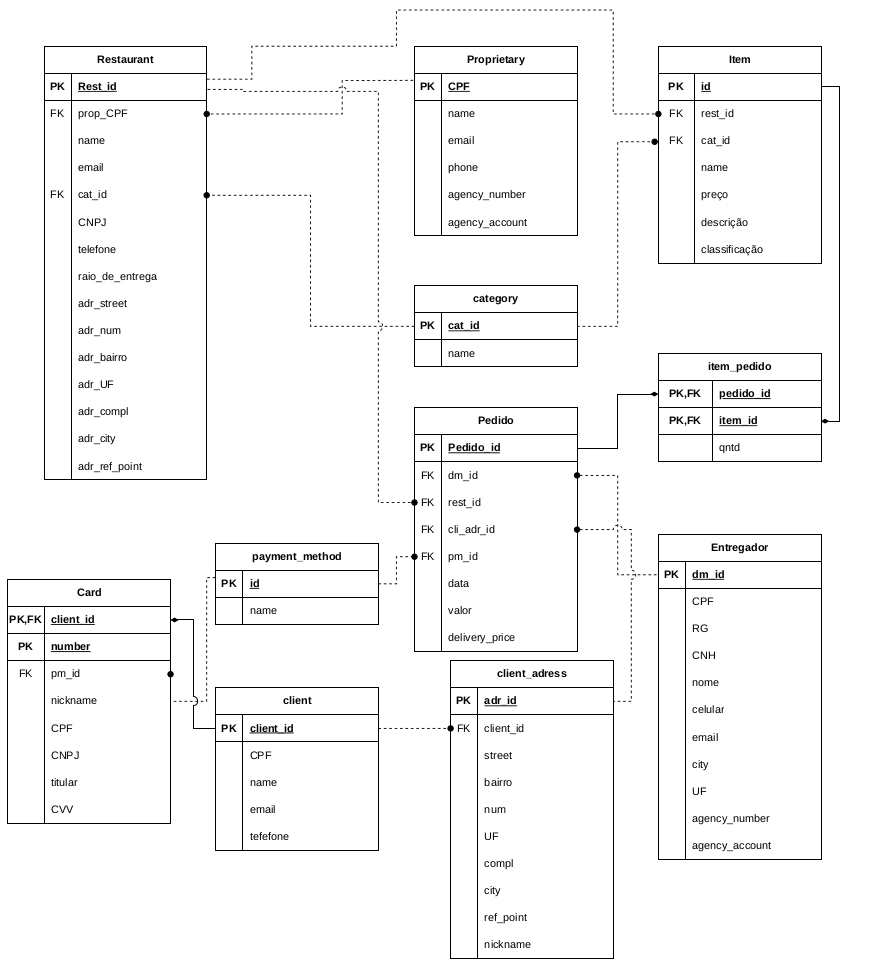

# Ifood SQL 🍔🍕🏪

Welcome to the SQL Project repository! This project contains [SQL scripts](ifood.sql) for a database system designed for managing an online food delivery service based on the [ifood](https://www.ifood.com.br). Below, you will find a table of contents that outlines the structure of this repository and instructions on how to contribute. 🚀

## Table of Contents 📜

1. [Database Schema](#database-schema-🏗️)
   - [Tables](#tables-📊)
      - [Proprietary](#Proprietary-🧑‍💼)
      - [Category](#category-🍽️)
      - [Restaurant](#restaurant-🏨)
      - [Item](#item-🍕)
      - [Payment Method](#payment-method-💳)
      - [Client](#client-👤)
      - [Client Address](#client-address-🏡)
      - [Client Card](#client-card-💳)
      - [Deliveryman](#deliveryman-🚚)
      - [Orders](#orders-📦)
      - [Order Item](#order-item-🛒)
   - [Sequences](#sequences-🔢)
1. [Views](#views-👁️)
    - [Res Order View](#res-order-view-🍽️)
    - [Res Price Order View](#res-price-order-view-💰)
    - [Cli Card View](#cli-card-view-💳)
    - [Cli Adr View](#cli-adr-view-🏡)
    - [Deliverys View](#deliverys-view-🚚)
1. [User Roles and Access](#user-roles-and-access-👤🔐)
1. [Contributing](#contributing-🤝)
1. [License](#license-📄)

## Database Schema 🏗️

The database schema is defined by the following tables, sequences, and views:

### Tables 📊

#### Proprietary 🧑‍💼

- Stores information about restaurant owners.
- Fields: `cpf`, `name`, `agency_number`, `account_number`, `email`, `phone`.

#### Category 🍽️

- Manages restaurant categories.
- Fields: `id`, `name`.

#### Restaurant 🏨

- Contains details about restaurants.
- Fields: `id`, `name`, `email`, `adr_street`, `adr_num`, `adr_uf`, `adr_compl`, `adr_bairro`, `adr_city`, `adr_ref_point`, `cnpj`, `telefone`, `raio_de_entrega`, `prop_cpf`, `cat_id`.

#### Item 🍕

- Lists food items available for order.
- Fields: `id`, `rest_id`, `cat_id`, `name`, `price`, `description`, `classification`.

#### Payment Method 💳

- Manages payment methods for clients.
- Fields: `id`, `name`.

#### Client 👤

- Stores client information.
- Fields: `id`, `cpf`, `name`, `email`, `telefone`.

#### Client Address 🏡

- Contains details about client addresses.
- Fields: `id`, `client_id`, `street`, `bairro`, `num`, `uf`, `compl`, `city`, `ref_point`, `nickname`.

#### Client Card 💳

- Manages client payment cards.
- Fields: `pm_id`, `client_id`, `nickname`, `number`, `cpf`, `titular`, `cvv`, `cnpj`.

#### Deliveryman 🚚

- Stores information about delivery personnel.
- Fields: `id`, `cpf`, `rg`, `cnh`, `name`, `email`, `city`, `uf`, `agency_number`, `account_number`.

#### Orders 📦

- Records order details.
- Fields: `id`, `dm_id`, `rest_id`, `cli_adr_id`, `pm_id`, `date_time`, `delivery_price`.

#### Order Item 🛒

- Manages items in orders.
- Fields: `order_id`, `item_id`, `qntd`.

### Sequences 🔢

- **cat_id_seq**: A sequence for generating unique category IDs.
- **client_adress_id_seq**: A sequence for generating unique client address IDs.
- **client_id_seq**: A sequence for generating unique client IDs.
- **entregador_id_seq**: A sequence for generating unique deliveryman IDs.
- **item_id_seq**: A sequence for generating unique item IDs.
- **orders_id_seq**: A sequence for generating unique order IDs.
- **payment_method_id_seq**: A sequence for generating unique payment method IDs.
- **rest_id_seq**: A sequence for generating unique restaurant IDs.

## Views 👁️

### Res Order View 🍽️

- Displays information about orders, including the restaurant name, item name, and quantity ordered.

### Res Price Order View 💰

- Provides insights into orders' total prices, quantities, and earnings for each restaurant.

### Cli Card View 💳

- Shows information about client cards, including the cardholder's name, card number, function, and more.

### Cli Adr View 🏡

- Displays client address details, including the street, neighborhood, city, and reference point.

### Deliverys View 🚚

- Offers information about deliveries, including client and restaurant addresses for each order.

## User Roles and Access 👤🔐

This section defines user roles and their associated access rights, ensuring secure and controlled access to the database:

- **administrador**: Admin role with extensive database privileges, ensuring smooth administration.
- **estabelecimento**: Role for restaurant owners with specific access rights to manage their establishments.
- **cliente**: Role for customers with limited access to manage their addresses and payment methods.
- **entregador**: Role for delivery personnel with access to delivery-related data.

## Contributing 🤝

Contributions to this project are highly encouraged! To contribute, follow these steps:

1. Fork the repository.
2. Create a new branch for your changes.
3. Make your changes or additions to the SQL scripts.
4. Commit your changes with clear and concise commit messages.
5. Push your changes to your forked repository.
6. Create a pull request to merge your changes into this repository.

## License 📄

This project is licensed under the MIT License, see `LICENSE` for more. Feel free to use, modify, and distribute it according to the terms of this license.

Happy querying! 🍕🍔🍟
